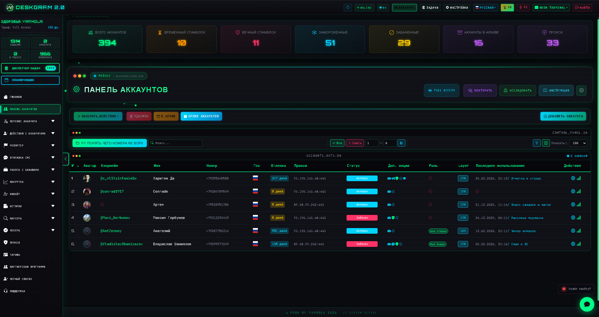
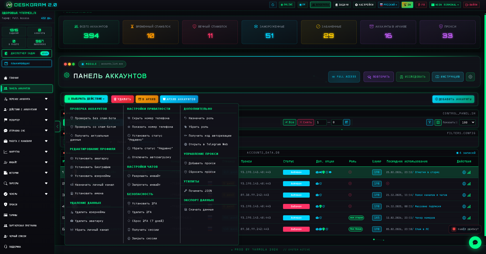
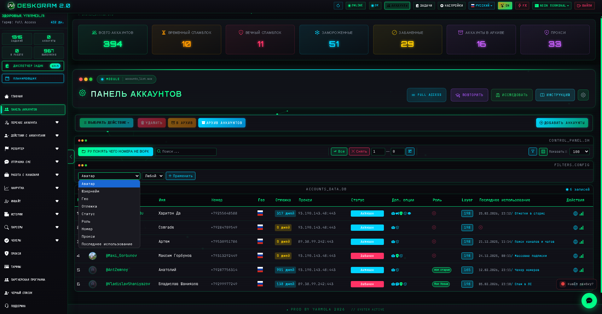

# Панель аккаунтов Telegram в Deskgram 2

Панель аккаунтов в Deskgram 2 — это инфраструктурный раздел для добавления, организации, фильтрации и массового управления Telegram-аккаунтами. Здесь начинается почти любой рабочий сценарий: от подготовки сетки аккаунтов до запуска рассылок, инвайта и AI-модулей.

[Главный хаб Deskgram 2](https://github.com/Deskgram-2/deskgram-2-telegram-automation) · [Сайт](https://deskgram2.com/) · [Telegram-бот](https://t.me/DG2welcomebot) · [Web preview](https://deskgram2.com/web-preview)

## Кратко о разделе

| Параметр | Что внутри |
|---|---|
| Основная задача | Хранение и управление базой Telegram-аккаунтов |
| Что помогает делать | Добавлять аккаунты, искать, фильтровать, группировать и выполнять массовые действия |
| Полезен для | Любых сценариев, где используются Telegram-аккаунты |
| Важные зоны | Тулбар действий, панель управления, фильтры, таблица аккаунтов |
| Связанные разделы | Прокси, Инвайт, Рассылка в ЛС |

## Что умеет панель аккаунтов

- хранить рабочую базу Telegram-аккаунтов;
- выполнять массовые действия через тулбар;
- использовать поиск, папки и фильтры;
- настраивать отображение колонок и выборки;
- ускорять подготовку аккаунтов перед запуском модулей;
- держать аккаунтную инфраструктуру в одном месте.

## Быстрый старт

1. Добавьте аккаунты в систему.
2. Разложите их по папкам или рабочим группам.
3. Используйте фильтры и поиск для нужной выборки.
4. При необходимости выполните массовые действия через тулбар.
5. Передайте подготовленные аккаунты в рабочий модуль.

## Интерфейс раздела

### Главный экран

На главном экране находится таблица аккаунтов и основная панель управления базой.

### Действия с аккаунтами

Через выпадающее меню можно запускать массовые операции, архивирование и другие служебные действия.

### Фильтры и выборки

Фильтры помогают быстро собрать нужную группу аккаунтов под конкретный сценарий работы.

## Когда особенно полезен

- когда у вас много Telegram-аккаунтов и нужна единая структура;
- когда важно быстро переключаться между рабочими группами;
- когда подготовка аккаунтов идет перед рассылками, инвайтом или парсингом;
- когда массовые действия должны выполняться без ручной рутины по каждому аккаунту.

## Почему это удобнее разрозненного учета

| Ручной подход | Панель аккаунтов в Deskgram 2 |
|---|---|
| Аккаунты лежат в разных папках и файлах | Есть единая рабочая база |
| Сложно быстро собрать нужную группу | Есть поиск, фильтры и папки |
| Массовые действия занимают много времени | Есть централизованный тулбар операций |
| Инфраструктура не связана с модулями | Аккаунты сразу используются в рабочих сценариях |
| Трудно поддерживать порядок в сетке | Управление сосредоточено в одном интерфейсе |

## Смежные репозитории

- [Главный хаб Deskgram 2](https://github.com/Deskgram-2/deskgram-2-telegram-automation)
- [Управление прокси](https://github.com/Deskgram-2/telegram-proxy-manager-deskgram)
- [Инвайт](https://github.com/Deskgram-2/telegram-invite-tool-deskgram)

## FAQ

### С чего обычно начинается работа в Deskgram 2?

Чаще всего именно с панели аккаунтов: здесь формируется рабочая база под остальные модули.

### Для чего нужны папки и фильтры?

Они помогают быстро собирать выборки аккаунтов под разные задачи и сценарии.

### Подходит ли этот раздел только для больших сеток?

Нет. Даже при небольшом количестве аккаунтов централизованный учет сильно упрощает работу.

### Что логично делать после подготовки аккаунтов?

Обычно следующий шаг — настроить прокси, проверить системные параметры и перейти в нужный модуль.

## Полезные ссылки

- [Главный хаб Deskgram 2](https://github.com/Deskgram-2/deskgram-2-telegram-automation)
- [Сайт Deskgram 2](https://deskgram2.com/)
- [Telegram-бот Deskgram 2](https://t.me/DG2welcomebot)
- [Web preview](https://deskgram2.com/web-preview)
